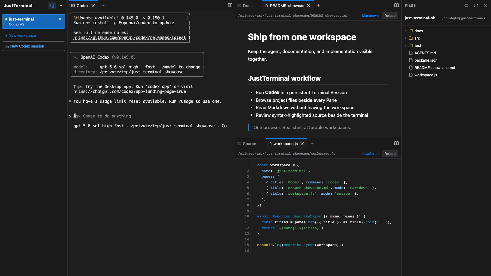

# [JustTerminal](https://justterminal.com)

**Your terminal, with room for the whole project.**

Keep a coding agent in one pane, your dev server in another, and the files you're reviewing beside them. When you need to leave, close the tab. Your shells keep running, ready for you to reconnect from your laptop or phone.

JustTerminal runs on your own machine or server and opens in a browser. Use the shell, editor, and command-line tools you already know.

[Try it](#try-it) · [Self-hosting guide](docs/running-just-terminal.md) · [Report an issue](https://github.com/maxbaines/just-terminal-docs/issues)



## A workspace for each project

Give a project a workspace, then arrange it around what you're doing. Split terminals to watch commands side by side, keep extra shells in tabs, or drag a pane into the sidebar to start a separate workspace.

The sidebar shows each workspace's current directory, Git branch, and change count. When you come back to a project, there's enough context to find your place.

## See which agent needs you

Run Codex, Claude Code, or another terminal agent in a pane. For Codex, there's also a **New Codex session** button: choose a project folder and start from there.

Codex's sidebar cards show its current task, remaining context, and requests for answers or approval. Leave several sessions working and see which one needs your attention without checking them all.

Agents can use the [built-in MCP server](docs/running-just-terminal.md#agent-integration-with-mcp) to create panes, run commands, read terminal screens, and expose local apps, too.

## Read the files beside the terminal

The file sidebar follows your active terminal as you `cd` through a project, with Git change badges beside the files. Open a file from the tree or click a detected path in terminal output to read it in a tab.

Source code gets syntax highlighting, Markdown is rendered, and images open as previews. HTML files have both preview and source views. The viewers are read-only: use them to check an agent's changes, read a plan, or inspect a log while keeping your editor in the terminal.

## Work with S3 alongside local files

Switch the sidebar from **Local** to **S3** to browse buckets and folders. Save connections to AWS S3 or compatible services with custom endpoints; credentials stay on the JustTerminal host.

- Upload from your computer and download to your browser.
- Copy between the host and S3, or between buckets and connections.
- Select several files or copy a whole folder at once.
- Follow progress in **Transfers**, resolve overwrites, cancel jobs, or retry them.
- Delete objects and folders with confirmation.

Copies between the host and S3, or between S3 connections, run in the background on the server. They keep going when you close the tab. Job history survives a server restart, with interrupted jobs available to retry.

Add a connection in **Settings → S3**. “Local” refers to the machine running JustTerminal; uploads and downloads reach the computer you're browsing from.

## Open what you're building

Start a web app in a terminal and add its port in **Settings → Local apps**. Open the resulting URL to try it out. Assets, redirects, cookies, and WebSockets work through the tunnel.

Each app gets its own hostname, so a remote deployment doesn't need another published container port for every dev server. Set up wildcard DNS, TLS, and proxy routing once using the [local app guide](docs/local-app-tunnels.md).

## Come back from another device

Your terminal sessions live on the host. Close the browser or lose your connection, then reconnect to the current screen and scrollback. Sessions also survive a restart of the web server while the process that owns the shells keeps running.

Use JustTerminal in a browser or install it as a PWA. On a phone, a modifier-key bar puts terminal shortcuts within reach, alongside touch controls and voice input where supported. On any screen, choose from nine themes and configure your keyboard shortcuts.

A host reboot or container replacement still ends running shells. Persistent storage keeps your files, settings, workspace names, and resumable agent history. See [what survives a restart](docs/running-just-terminal.md#what-persistence-means).

## Try it

JustTerminal is under active development. The source repository is private; the build instructions below require collaborator access. Public documentation and issue reports live in [just-terminal-docs](https://github.com/maxbaines/just-terminal-docs).

With source access, start with a local build on **macOS, Linux, or WSL2**, using **Go 1.24.4**, **Node.js 22**, npm, and make:

```bash
git clone https://github.com/maxbaines/just-terminal.git
cd just-terminal
make build
./bin/just-terminal
```

Your browser opens at **http://127.0.0.1:8311**. Local access needs no account setup. Agent CLIs are optional; install and sign in to the ones you want to use on the host.

For a first look:

1. Click **New workspace** and give your project a name.
2. `cd` into your project and start your usual shell tools or coding agent.
3. Add a terminal tab or split, then open the file sidebar to inspect your project alongside it.
4. Close the browser tab and reopen JustTerminal. Your session is still there.

Prebuilt downloads are not yet published on [GitHub Releases](https://github.com/maxbaines/just-terminal/releases). The repository also includes a Dockerfile with Codex CLI, Claude Code, Playwright with Chromium, and a shell toolbox; see [Docker and Coolify setup](docs/running-just-terminal.md#docker-and-coolify).

## Run it on your own terms

Keep it local, or put it behind HTTPS to reach it from other devices. Remote sign-in uses passkeys, TOTP, and recovery codes. Authentication lives on your host; there's no external identity service or database to set up.

- [Remote access and deployment](docs/running-just-terminal.md#remote-access)
- [Authentication and recovery](docs/authentication.md)
- [CLI reference and agent integrations](docs/running-just-terminal.md#cli)
- [Releases and updates](docs/running-just-terminal.md#releases-and-updates)

## Help shape JustTerminal

If something gets in your way, [open an issue](https://github.com/maxbaines/just-terminal-docs/issues) and tell us what you were trying to do. Source contributions require repository access. Collaborators should start with the [development guide](docs/running-just-terminal.md#contributing) and [AGENTS.md](AGENTS.md).

JustTerminal builds on [muxterm](https://github.com/kenotron-ms/muxterm). See [fork provenance](docs/fork-provenance.md) for its origins and upstream policy.

Licensed under [AGPL-3.0-or-later](LICENSE).
