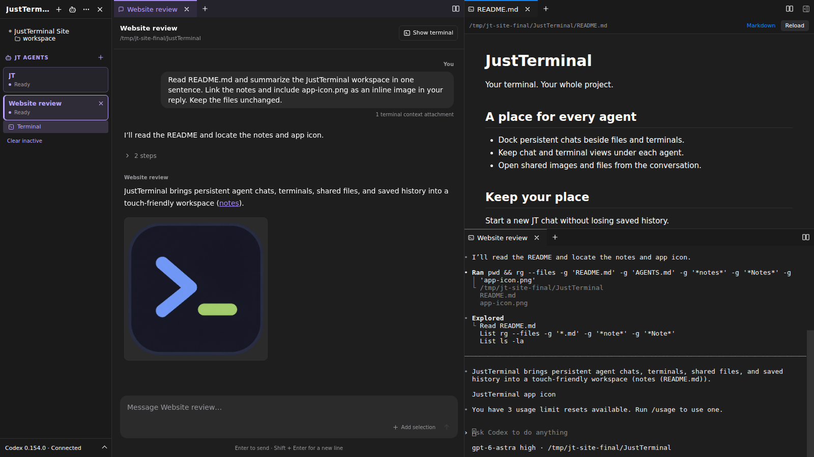
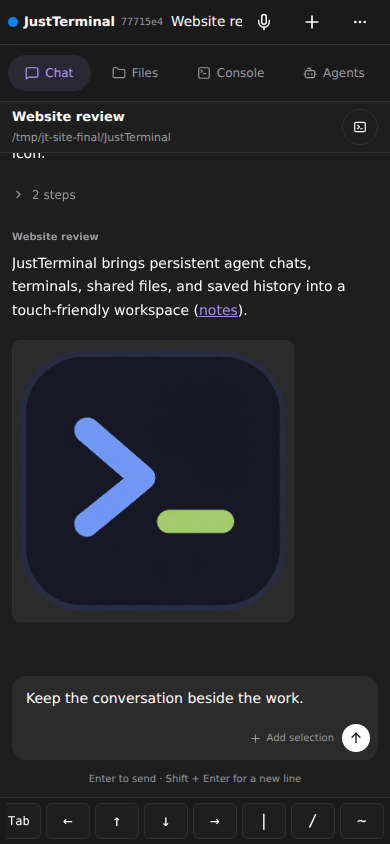

# [JustTerminal](https://justterminal.com)

**Your terminal. Your whole project.**

Give agents a task and a place to work. JustTerminal brings independent agents, real shells, and project files into one browser workspace on a machine you control. Keep the conversation beside the work, then pick it up again from your laptop, iPad, or phone.

[Download](#try-it) · [Website](https://justterminal.com) · [Workspace guide](docs/workspaces-and-agents.md) · [Self-hosting](docs/running-just-terminal.md)

## Give agents a task. Keep working.

Ask **JT**, the built-in agent, to arrange your workspace or recruit agents for a project. Or choose **New agent**, give it a folder and a task, and let it get to work. Each agent runs an independent Codex conversation with normal tools and project permissions, without needing a terminal pane.

Talk directly to any agent while it works. See which one needs your attention, answer supported questions and approvals in chat, and share the current pane context or selected terminal output. Other agents keep working.

On desktop, dock an agent's chat beside files and terminals, or keep it in a tab. Open a file or full-size image it shares. **Show terminal** opens the same conversation; closing a view leaves the agent running. Saved history lets you return to the conversation later.

Agent chats require **Codex installed and signed in on the host**. You can also run Claude Code, Codex, or your usual CLI agent in any terminal. The [built-in MCP server](docs/running-just-terminal.md#agent-integration-with-mcp) gives agents tools to manage workspaces, inspect terminals and files, move data through S3, and expose local apps.

## A real workspace around the conversation

- **Your shells and tools.** Split panes, stack tabs, and arrange a workspace for each project. Keep your editor, dev server, and CLI tools running together, with the current directory, Git branch, and change count visible.
- **Files beside the terminal.** A file tree that follows you as you `cd`, Git change badges, highlighted source, rendered Markdown, images, and HTML previews. Open paths from terminal output or agent replies. Viewers are read-only; edit with your usual tools.
- **Context within reach.** Type `/` in chat to autocomplete host files and folders. Paste a screenshot into a terminal to save it on the host and insert its path. Browse Codex skills, read their instructions, and choose which are enabled for your work.
- **Local files and S3.** Browse AWS S3 or compatible storage, upload and download, and copy files or whole folders between your host and S3 connections. Server-side transfers continue after you close the tab, with progress, overwrite decisions, and retries.
- **A URL for your dev server.** Give a local app its own hostname, with assets, redirects, cookies, and WebSockets carried through the tunnel. Remote deployments need wildcard DNS, TLS, and proxy routing; see the [local app guide](docs/local-app-tunnels.md).

See the [workspace and agent guide](docs/workspaces-and-agents.md) for controls, skills, file browsing, S3 transfers, and everyday workflows.

## Step away. Keep your place.

Your shells stay on the host when the browser disconnects. Reconnect to the current screen and scrollback, including after a web-server restart that leaves the Session Owner running.

On a phone, move between **Chat**, **Files**, **Console**, and **Agents**, with extra terminal keys within reach. Drag and dock panes on iPad, or install JustTerminal as a PWA. Choose from nine themes and configure your keyboard shortcuts.

  

A **host reboot or container replacement ends running shells**. Persistent storage keeps files, settings, workspace names, and resumable agent history. S3 job history survives a server restart; interrupted transfers can be retried. See [what persistence means](docs/running-just-terminal.md#what-persistence-means).

## Try it

JustTerminal is under active development. [Public releases](https://github.com/maxbaines/just-terminal-docs/releases/latest) include the web UI; **no Go, Node.js, or private repository access is needed** to run a download.

| Platform | Download |
|---|---|
| Linux | [x64](https://github.com/maxbaines/just-terminal-docs/releases/latest/download/just-terminal_linux_amd64.tar.gz) · [ARM64](https://github.com/maxbaines/just-terminal-docs/releases/latest/download/just-terminal_linux_arm64.tar.gz) |
| macOS | [Intel](https://github.com/maxbaines/just-terminal-docs/releases/latest/download/just-terminal_darwin_amd64.tar.gz) · [Apple silicon](https://github.com/maxbaines/just-terminal-docs/releases/latest/download/just-terminal_darwin_arm64.tar.gz) |
| Windows (WSL2) | Use the Linux build inside WSL2; [setup instructions](docs/running-just-terminal.md#windows-wsl2) |

[Verify and extract the archive](docs/running-just-terminal.md#download-and-run), run `./just-terminal`, and open **http://127.0.0.1:8311**. Local loopback access needs no account setup. Create a workspace for your project, or choose **JT** to give it a task once Codex is installed and signed in.

**Recommended for a VPS:** SSH into an Ubuntu/Debian server, install the native
release, and use [Caddy for public HTTPS](docs/running-just-terminal.md#caddy-public-https)
or [Tailscale Serve for private HTTPS](docs/running-just-terminal.md#tailscale-private-https).
The [remote setup guide](docs/running-just-terminal.md#remote-access) covers
installation, startup after reboot, and owner enrollment. No Docker required.

macOS builds are unsigned and not notarized; see the [macOS installation notes](docs/running-just-terminal.md#macos). Windows requires WSL2; there is no native Windows executable. The [installation guide](docs/running-just-terminal.md#download-and-run) also covers checksums and the optional installer.

## Run it on your own machine or server

Keep it local, or self-host behind HTTPS for access from other devices. Remote authentication uses passkeys, TOTP, and recovery codes stored on your host, with no external identity service or database to set up.

- [Self-hosting and remote access](docs/running-just-terminal.md#remote-access)
- [Docker and Coolify](docs/running-just-terminal.md#docker-and-coolify) — the public release-based Dockerfile includes Codex CLI, Claude Code, Playwright with Chromium, and a shell toolbox.
- [Authentication and recovery](docs/authentication.md)
- [CLI reference](docs/running-just-terminal.md#cli) · [Releases and updates](docs/running-just-terminal.md#releases-and-updates)

**The source repository is private.** Downloads, public Docker builds, documentation, and issue reports are available through [just-terminal-docs](https://github.com/maxbaines/just-terminal-docs). [Building from source](docs/running-just-terminal.md#build-and-run) requires collaborator access, macOS/Linux/WSL2, Go 1.24.4, Node.js 22, npm, and make.

Found a rough edge? [Open an issue](https://github.com/maxbaines/just-terminal-docs/issues) or read the [contribution guidelines](CONTRIBUTING.md). Source collaborators should also read [AGENTS.md](AGENTS.md).

Built on [muxterm](https://github.com/kenotron-ms/muxterm) · [Fork provenance](docs/fork-provenance.md) · [AGPL-3.0-or-later](LICENSE)
